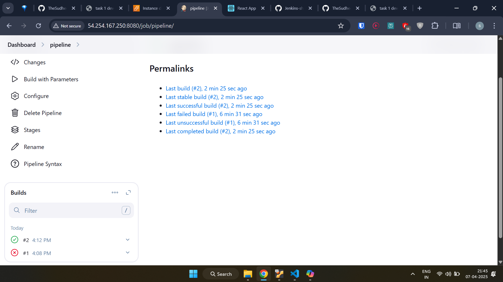
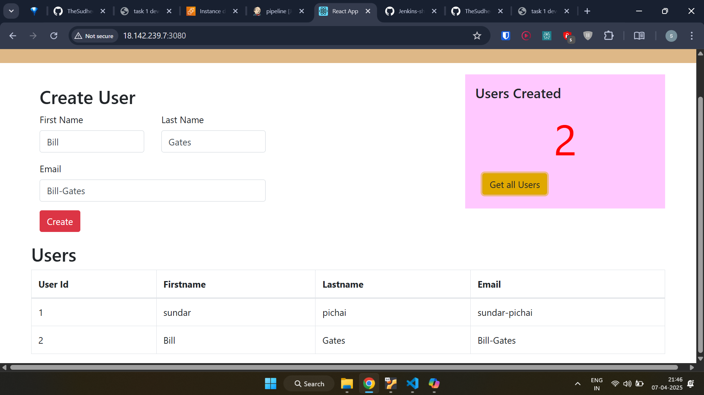

---

# CI/CD Pipeline

This repository contains the `Jenkinsfile` and associated configuration for a Continuous Integration and Continuous Deployment (CI/CD) pipeline. The pipeline automates the process of testing a React.js application, building a Docker image, pushing it to Docker Hub, and deploying it to an AWS EC2 instance.

**Objective:**  
To demonstrate a functional CI/CD workflow suitable for modern web application development and deployment.

---

## Proof of Execution (Screenshots)

*Below are proofs of a successful pipeline execution and the running application.*

### 1. Jenkins Build Success

*Description: This screenshot shows the Jenkins pipeline view, indicating that all stages (Test, Docker Build, Push to DockerHub, Deploy to EC2-Server) completed successfully.*

### 2. Running Web Application on EC2

*Description: This screenshot shows the React application successfully running and accessible via a web browser, served from the EC2 instance on port 3080.*

---

## Prerequisites

Before running this pipeline, ensure that you have the following set up:

1. **Jenkins Server:**  
   A running Jenkins instance.

2. **Jenkins Plugins:**
   - Pipeline
   - Docker Pipeline (or Docker plugin)
   - Credentials Binding
   - SSH Agent
   - Git (if pulling the `Jenkinsfile` from SCM)

3. **Jenkins Agent Configuration:**
   - The Jenkins agent (using `agent any` implies any available agent) must have Docker installed and running.
   - The Jenkins agent must have Node.js and npm installed to run the tests (`npm test`).
   - The user running the Jenkins agent process must have permissions to execute Docker commands.

4. **Source Code:**  
   The React.js application source code must include:
   - A `package.json` file with test scripts defined.
   - A `Dockerfile` in the root directory to build the application image.

5. **Docker Hub Account:**  
   A Docker Hub account to push the image to.

6. **AWS EC2 Instance:**
   - An EC2 instance running a Linux distribution (e.g., Ubuntu).
   - Docker installed and running on the EC2 instance.
   - The EC2 instance's security group must allow inbound traffic on port 3080 (or the port your application uses) and port 22 (for SSH).

7. **Jenkins Credentials:**
   - **`docker-hub-credentials`:**  
     Jenkins Username/Password credential type containing your Docker Hub username and password (or access token).
   - **`ec2-server-key`:**  
     Jenkins SSH Username with private key credential type containing the private key for SSH access to the EC2 instance, associated with the `ubuntu` user (or the user configured on your EC2).

---

## Pipeline Overview

The `Jenkinsfile` defines a declarative pipeline with the following key components:

### Parameters

- **`DEPLOY_ENV`**:  
  A string parameter to potentially specify the deployment environment (e.g., 'dev', 'staging', 'prod').  
  *Note: This parameter is defined but not explicitly used in the deployment logic of the provided stages.*

### Environment Variables

- **`IMAGE_TAG`**:  
  Set to the Jenkins build number (`${env.BUILD_NUMBER}`) for unique image tagging.
- **`imageName`**:  
  Constructs the full Docker image name:  
  `kalki2878/react-js-app:${env.BUILD_NUMBER}`.

### Stages

The pipeline executes the following stages sequentially:

1. **Test**
   - Prints a message indicating that testing is starting.
   - Executes `npm test` within the project directory.
   - Uses `CI=true` to signal that tests are running in a non-interactive CI environment.
   - The `|| true` at the end of the command causes the stage to pass even if the tests fail (for demonstration purposes). In a production pipeline, you might remove this to enforce passing tests.

2. **Docker Build**
   - Builds a Docker image using the `Dockerfile` located in the workspace root (`.`).
   - Tags the image using the `imageName` variable (e.g., `kalki2878/react-js-app:5`).

3. **Push to DockerHub Registry**
   - Uses the `withCredentials` step to securely inject Docker Hub credentials (`docker-hub-credentials`) into environment variables (`DOCKER_USERNAME` and `DOCKER_PASSWORD`).
   - Logs in to Docker Hub using the injected credentials.
   - Pushes the Docker image (`${imageName}`) to the Docker Hub repository.

4. **Deploy to EC2-Server**
   - Uses the `sshagent` step with the `ec2-server-key` credential to establish an SSH connection to the target EC2 instance.
   - Connects to `ubuntu@18.142.239.7` with the `-o StrictHostKeyChecking=no` option to automatically accept the host key (use with caution; ideally, manage known hosts).
   - Executes the following commands remotely:
     - `docker pull ${imageName}`: Pulls the latest version of the image from Docker Hub.
     - `docker run -d --name myapp -p 3080:3080 ${imageName}`: Runs the image as a detached container, names it `myapp`, and maps port 3080 on the host to port 3080 in the container.  
       **Note:** This command does not stop or remove any existing container named `myapp`. In a more robust deployment, consider stopping and removing the old container before starting the new one.
   - Prints a deployment confirmation message.

### Post Actions

- **Always Block:**  
  This block runs regardless of the pipeline's success or failure.
- **Archive Artifacts:**  
  Archives any files matching `**/test-results/**` or `**/logs/**` with `allowEmptyArchive: true` to prevent build failure if no such files are found.

---

## How to Run

1. **Ensure Prerequisites:**  
   Verify that all prerequisites listed above are met.

2. **Create a New Pipeline Job in Jenkins:**
   - In the "Pipeline" section, select **"Pipeline script from SCM"**.
   - Choose your SCM (e.g., Git) and provide the repository URL containing your code (including the `Jenkinsfile`).
   - Specify the branch (e.g., `main` or `master`).
   - Ensure the "Script Path" is set to `Jenkinsfile` (this is typically the default).

   *Alternatively, for testing, select "Pipeline script" and paste the content of the `Jenkinsfile` directly into the text area.*

3. **Save the Jenkins Job Configuration.**

4. **Trigger a Build:**
   - Click **"Build Now"** (or **"Build with Parameters"** if you want to change `DEPLOY_ENV`, although it is not used in this configuration).

5. **Monitor Pipeline Execution:**
   - Observe the pipeline execution using the Jenkins UI (Blue Ocean or the standard stage view).

---
